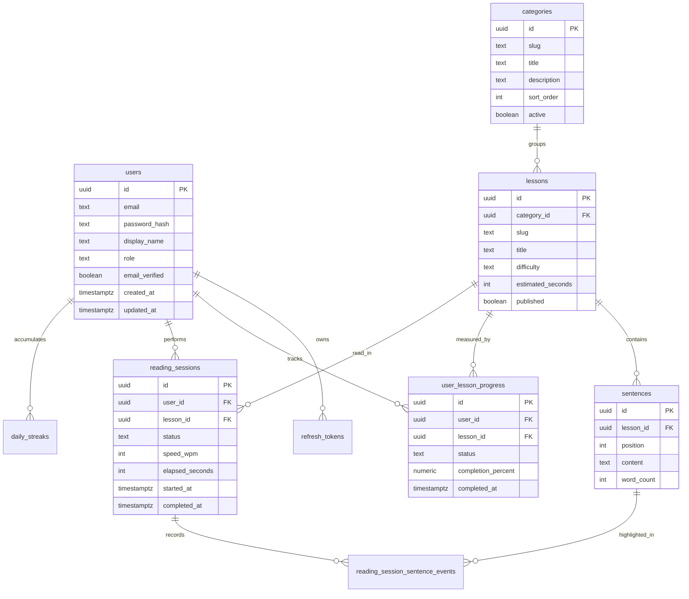

# Database

## Database Choice

PostgreSQL is the production database. It provides relational integrity, mature indexing, JSON support for future metadata, strong migration tooling, and reliable transactional behavior.

## Conventions

- Primary keys use UUID.
- Timestamps use `timestamptz` and UTC.
- Table names use snake_case plural nouns.
- Foreign keys are explicit.
- Soft deletion is used only where business history must be preserved.
- Application code owns business validation; database constraints protect integrity.

## ER Diagram

## Tables

### users

Stores application accounts.

Columns:

- `id uuid primary key`
- `email text not null unique`
- `password_hash text not null`
- `display_name text not null`
- `role text not null default 'USER'`
- `email_verified boolean not null default false`
- `preferred_timezone text not null default 'UTC'`
- `created_at timestamptz not null`
- `updated_at timestamptz not null`

Indexes:

- Unique index on `lower(email)`.
- Index on `created_at`.

### refresh_tokens

Stores refresh token records for revocation and rotation.

Columns:

- `id uuid primary key`
- `user_id uuid not null references users(id)`
- `token_hash text not null unique`
- `expires_at timestamptz not null`
- `revoked_at timestamptz`
- `created_at timestamptz not null`

Indexes:

- `refresh_tokens_user_id_idx`
- `refresh_tokens_expires_at_idx`

### categories

Groups lessons by topic or practice context.

Columns:

- `id uuid primary key`
- `slug text not null unique`
- `title text not null`
- `description text not null`
- `sort_order int not null default 0`
- `active boolean not null default true`
- `created_at timestamptz not null`
- `updated_at timestamptz not null`

Indexes:

- `categories_active_sort_order_idx`

### lessons

Represents a reading lesson.

Columns:

- `id uuid primary key`
- `category_id uuid not null references categories(id)`
- `slug text not null unique`
- `title text not null`
- `description text not null`
- `difficulty text not null`
- `estimated_seconds int not null`
- `default_speed_wpm int not null default 140`
- `published boolean not null default false`
- `sort_order int not null default 0`
- `created_at timestamptz not null`
- `updated_at timestamptz not null`

Constraints:

- `difficulty in ('BEGINNER', 'INTERMEDIATE', 'ADVANCED')`
- `estimated_seconds > 0`
- `default_speed_wpm between 60 and 260`

Indexes:

- `lessons_category_published_sort_idx`
- `lessons_difficulty_idx`

### sentences

Stores ordered sentence content for each lesson.

Columns:

- `id uuid primary key`
- `lesson_id uuid not null references lessons(id) on delete cascade`
- `position int not null`
- `content text not null`
- `word_count int not null`
- `created_at timestamptz not null`
- `updated_at timestamptz not null`

Constraints:

- Unique `(lesson_id, position)`.
- `position > 0`.
- `word_count > 0`.

Indexes:

- `sentences_lesson_position_idx`

### user_lesson_progress

Stores the latest lesson-level progress per user.

Columns:

- `id uuid primary key`
- `user_id uuid not null references users(id)`
- `lesson_id uuid not null references lessons(id)`
- `status text not null`
- `completion_percent numeric(5,2) not null default 0`
- `last_sentence_position int`
- `last_speed_wpm int`
- `started_at timestamptz`
- `completed_at timestamptz`
- `updated_at timestamptz not null`

Constraints:

- Unique `(user_id, lesson_id)`.
- `status in ('NOT_STARTED', 'IN_PROGRESS', 'COMPLETED')`
- `completion_percent between 0 and 100`

Indexes:

- `user_lesson_progress_user_status_idx`
- `user_lesson_progress_lesson_idx`

### reading_sessions

Records each attempt at a lesson.

Columns:

- `id uuid primary key`
- `user_id uuid not null references users(id)`
- `lesson_id uuid not null references lessons(id)`
- `status text not null`
- `speed_wpm int not null`
- `elapsed_seconds int not null default 0`
- `words_read int not null default 0`
- `started_at timestamptz not null`
- `completed_at timestamptz`
- `client_platform text not null`

Constraints:

- `status in ('ACTIVE', 'PAUSED', 'COMPLETED', 'ABANDONED')`
- `speed_wpm between 60 and 260`
- `elapsed_seconds >= 0`
- `words_read >= 0`

Indexes:

- `reading_sessions_user_started_idx`
- `reading_sessions_lesson_idx`
- `reading_sessions_status_idx`

### reading_session_sentence_events

Records sentence-level progress events for analytics and resume behavior.

Columns:

- `id uuid primary key`
- `reading_session_id uuid not null references reading_sessions(id) on delete cascade`
- `sentence_id uuid not null references sentences(id)`
- `sentence_position int not null`
- `started_at timestamptz not null`
- `completed_at timestamptz`
- `elapsed_seconds int not null default 0`

Indexes:

- `reading_session_sentence_events_session_idx`
- `reading_session_sentence_events_sentence_idx`

### daily_streaks

Stores daily practice history by user-local date.

Columns:

- `id uuid primary key`
- `user_id uuid not null references users(id)`
- `practice_date date not null`
- `timezone text not null`
- `sessions_completed int not null default 0`
- `seconds_read int not null default 0`
- `words_read int not null default 0`
- `created_at timestamptz not null`
- `updated_at timestamptz not null`

Constraints:

- Unique `(user_id, practice_date)`.
- Counters must be non-negative.

Indexes:

- `daily_streaks_user_date_idx`

## Future Tables

Future AI and speech features should add tables without changing Phase 1 core tables:

- `pronunciation_attempts`
- `speech_transcripts`
- `ai_feedback`
- `ai_prompt_versions`
- `lesson_recommendations`
- `content_import_jobs`

## Migration Strategy

Use Flyway migrations through Quarkus. Every schema change must include:

- Forward migration.
- Test data impact analysis.
- API compatibility review.
- Index review for changed queries.
- Documentation update in this file when the conceptual schema changes.

