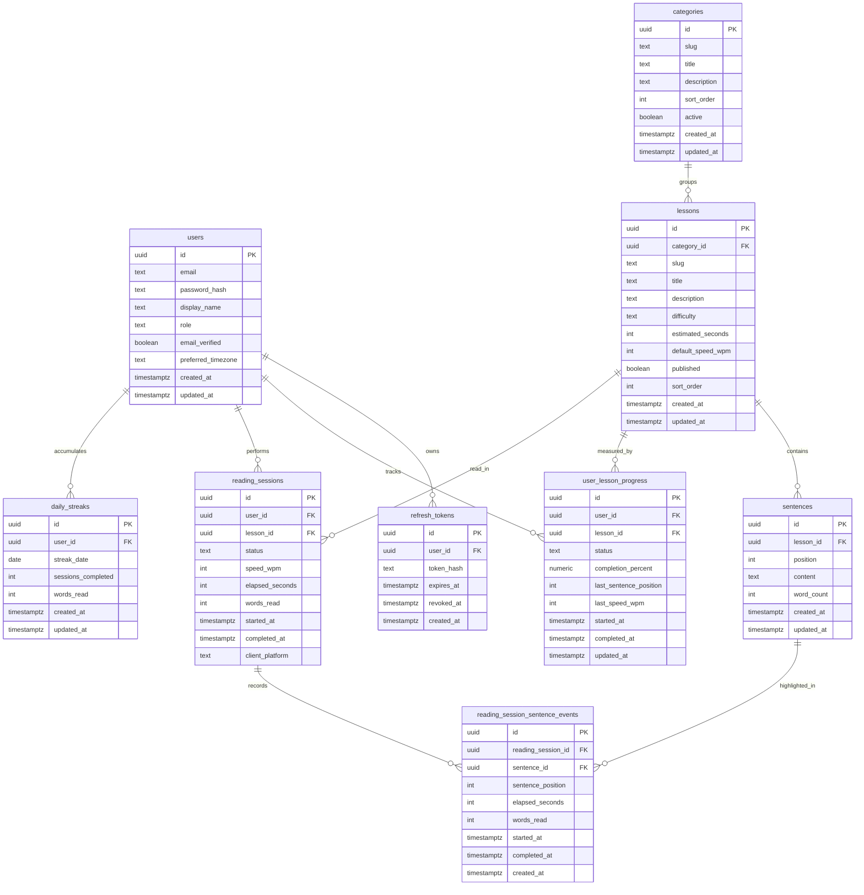

# Entity Relationship Documentation

This document mirrors the PostgreSQL schema managed by Flyway migrations in `backend/english-reading-coach-api/src/main/resources/db/migration`.

## Diagram

## Migration Map

- `V1__foundation.sql`: core user, auth token, catalog, progress, session, and streak tables.
- `V2__reading_session_sentence_events.sql`: sentence-level reading event table and indexes.
- `V3__seed_catalog_content.sql`: starter categories, lessons, and sample sentences.

## Index Summary

- User identity and creation: `users_email_lower_idx`, `users_created_at_idx`.
- Token lookup and expiry: `refresh_tokens_user_id_idx`, `refresh_tokens_expires_at_idx`.
- Catalog browsing: `categories_active_sort_order_idx`, `lessons_category_published_sort_idx`, `lessons_difficulty_idx`, `sentences_lesson_position_idx`.
- Progress and sessions: `user_lesson_progress_user_status_idx`, `user_lesson_progress_lesson_idx`, `reading_sessions_user_started_idx`, `reading_sessions_lesson_idx`, `reading_sessions_status_idx`.
- Sentence events and streaks: `reading_session_sentence_events_session_idx`, `reading_session_sentence_events_sentence_idx`, `reading_session_sentence_events_session_completed_idx`, `daily_streaks_user_date_idx`.
